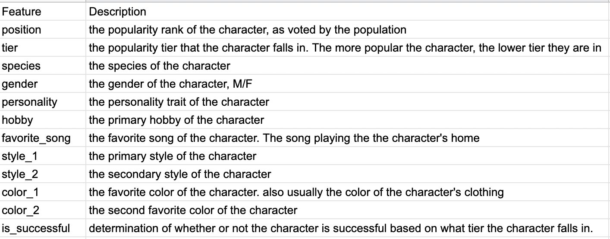

# Animal Crossing New Horizons Character Popularity Analysis

## Project Oversight
- Use information from the Animal Crossing New Horizon character catalog csv to acquire, prepare, explore, and make models to predict whether or not a new character will be successful

## Project Goals
### Answer the questions: What features, if any, can be used to help determine whether or not a new character will be successful in the game Animal Crossing New Horizons? How can these features be combined to predict the success of a new character?

- Ask questions during the exploration phase to better understand what characteristics could be factoring into the target variable of whether or not a character is successful. 
    - answer those questions with statistical testing and visualizations
- These answers will be used to hopefully help predict whether or not a new character will be successful in the future. 
- Construct machine learning models for predicting whether or not a new character will be successful 
    -run the most effective machine learning model against test
-ensure everything is annotated and documented
- make final recommendations and provide next steps

## Business Goals/ Description

- Find key drivers of success for characters in the game animal crossing new horizon 
- Construct a machine learning model that can be used to predict whether or not a character is successful given the characteristics of the character. 
    -This model should be able to beat the baseline of 82%
- This information will be used to give more insight to what characteristics should be given to characters in order to:
    - develop characters that have a high likelyhood of being successful in order to market those characters and sell them in bundles
    - reduce using manpower developing characters that wouldn't be popular

## Audience
- Peers 

## Deliverables
- Jupyter Notebook containing the final report
- Python Modules that can be used to reproduce the work
- scratch notebook that can be referred to for my work
-readme file explaining the project

## Data Dictionary 

## Project plan 

- Acquire the animal crossing new horizons character csv data from https://www.kaggle.com/datasets/jessicali9530/animal-crossing-new-horizons-nookplaza-dataset
- Clean and prepare the data for the exploration file. Create a prepare.py file to recreate the work
- Explore the data and ask questions to clarify what is actually happening. 
  - ensure to properly annotate, comment, and use markdowns
  - write out each null and alternative hypothesis
  - visualize the data
  - run statistical test on the data
- create at least 3 different machine learning models
- choose the model that performs the best
  - evaluate on test
- Deliver final presentation to peers

## Initial Hypotheses:
- The species, gender, hobby, and color_1 play a large part on whether or not a character will be successful
- While favorite_song might play a roll, i don't know that it will be significant enough to determine whether a character will be successful
- The style of the character will also play a role, since this will be tied in with how they look

## Executive Summary
- There are a few things that can help in determining whether or not a character will be successful in Animal Crossing New Horizons.

- Some of the things that we can use to help predict whether or not a character will be successful are (in order of importance) :
    - Species, Style_1, Gender, and Personality
    - A character's hobby can also be a slight driver in determining whether or not they will be successful, but it isn't as strong of a driver as the aforementioned categories.
- The decisioin tree model that I produced is able to determine whether or not a new character will be successful or not with 96% accuracy and with a 70% recall

## Reproduce the project
- In order to reproduce the project, you will need
  - Access to the dataset through kaggle
  - Access to https://nookipedia.com/wiki/Villagers/New_Horizons in order to get the information for the missing characters
  - Access to https://www.animalcrossingportal.com/games/new-horizons/guides/villager-popularity-list.php#/ in order to get the ranking position for each of the characters.
  - Understanding of what log error is (can be found in data dictionary)
  